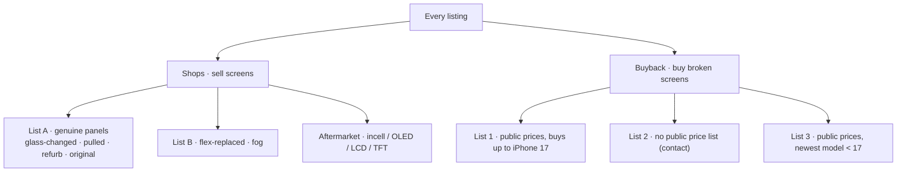
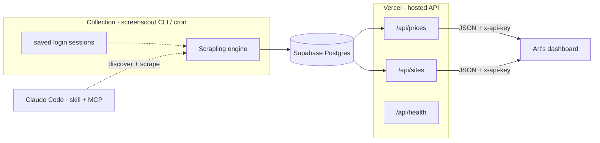

# iPhone Screen Price Intelligence

Live pricing for iPhone replacement screens across the European (and global) repair
market — both **shops that sell** screens and **sites that buy** broken ones — delivered
through one hosted API and one CLI tool.

Two ways to consume it:
- **Art's dashboard** → reads the hosted **API** → see **[artifact.md](artifact.md)**
- **Operators / automation** → run the **`screenscout` CLI** → see **[SCREENSCOUT.md](SCREENSCOUT.md)**

---

## What's in the database (live, verified, de-duplicated)

| | |
|---|--:|
| **Total prices** | **4,440** |
| Shop prices | 3,628 |
| Buyback prices | 864 |
| Distinct verified sites | 297 |
| Competitors catalogued (incl. login-gated) | 1,209 across Europe + global |
| Login-gated shops (prices behind a business account) | 295 |

Every figure is **real** — accessories, wrong-brand items, repair-service blobs,
whole-phone trade-in prices, and duplicates are removed automatically (see *Data quality*).

---

## How the data is organised



- **Shop lists** are queryable from the API: `?list=A | B | aftermarket`.
- **Buyback lists** (files in `deliverables/`) sort sites by how current they are:
  **List 1** — 22 sites, buy up to iPhone 17 · **List 2** — 87 contact-only ·
  **List 3** — 30 with older-model price lists.

---

## Architecture



---

## Quick links

| Doc | For whom | Contents |
|---|---|---|
| **[artifact.md](artifact.md)** | Silas · dashboard integration | API base + key, every endpoint & filter, response schema, copy-paste code |
| **[SCREENSCOUT.md](SCREENSCOUT.md)** | Operators · automation | one-command install, `refresh` / `discover` / `scrape` / `clean`, daily cron, MCP for Claude Code |
| `deliverables/` | Everyone | CSV exports — shop & buyback prices, the 3 buyback lists, per-region stats, full EU competitor list |

---

## 30-second smoke test
```bash
curl -s https://phone-price-tracker-sigma.vercel.app/api/health

curl -s -H "x-api-key: art_RfIaropliZDoi_Lr0FwfsbZZ7Ls4WYsH" \
  "https://phone-price-tracker-sigma.vercel.app/api/prices?list=A&country=Germany"
```

---

## Data quality (why the counts are trustworthy)

Naive scrapers inflate numbers with garbage; this pipeline rejects it automatically:

- **Shops** — a row is kept only if it's a real single iPhone-screen product: contains a
  screen word, is not an accessory / other-brand / repair-service listing, is not a
  multi-price text-blob, price ≥ €10, and only one row per product (net/gross and
  discount duplicates collapsed).
- **Buyback** — prices are FX-normalised to EUR, then whole-phone **trade-in** sites
  (a broken screen never exceeds ~€180) and parser-junk are dropped.

This is why small markets no longer out-rank big ones, and why 1,300 buyback rows became
a real 864. Cleaning re-runs on every `screenscout refresh` / `scrape`.
