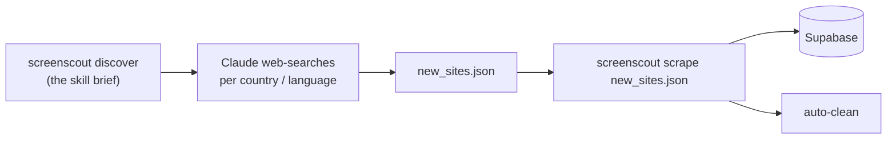

# screenscout — the operator CLI

One tool that bundles the whole pipeline: the Scrapling engine, every dependency, and all
commands. Built to run in **automated loops** (daily cron) and to drive from **Claude Code**
(a discovery skill + an MCP server).

> Dashboard integration is separate and needs none of this — see [artifact.md](artifact.md).
> Use `screenscout` only to keep the data fresh and to add new competitors.

---

## Install (one command)

```bash
pipx install "git+https://github.com/Momin010/phone-price-tracker.git"
# or:  pip install "git+https://github.com/Momin010/phone-price-tracker.git"

screenscout install      # one-time: pulls the Scrapling browser engine
```

Provide credentials once — as env vars, or a `.env` in the working directory:

```bash
export SUPABASE_URL=...
export SUPABASE_SECRET_KEY=...
```

---

## Commands

| Command | What it does |
|---|---|
| `screenscout stats` | live counts per region (sanity check) |
| `screenscout refresh` | re-scrape **every known site** for fresh prices, then auto-clean |
| `screenscout scrape sites.json` | scrape **new** sites from a JSON list, then auto-clean |
| `screenscout clean [--apply]` | remove junk / trade-in / duplicate rows (dry-run without `--apply`) |
| `screenscout discover` | print the discovery brief (hand to Claude) |
| `screenscout serve-mcp` | run the MCP server for Claude Code |

---

## The daily loop (requirement #1 — refresh what we have)

```bash
screenscout refresh
```

Re-scrapes every site already in the database, inserts fresh prices, and removes
over-extraction junk, whole-phone trade-in rows, and net/gross duplicates. Deterministic,
no AI, free. Put it on cron:

```bash
0 3 * * *  cd /path/to/workdir && screenscout refresh >> screenscout.log 2>&1
```

---

## Adding new competitors (requirements #2 + #3)

Finding *new* real sites needs judgement + web search, so **Claude does the discovery**
and `screenscout` does the scraping.



1. **Discover** — `screenscout discover` prints the skill (what to search, how, and the
   output format). Claude runs it and produces a JSON array:
   ```json
   [ { "site": "example.de", "country": "Germany",
       "listing_url": "https://example.de/iphone-displays",
       "type": "shop", "login_likely": false } ]
   ```
2. **Scrape** — feed that list in:
   ```bash
   screenscout scrape new_sites.json
   ```
   Scrapling fetches each site, extracts iPhone-screen prices (shops) or grade-by-grade
   buy prices (buyback), inserts them, de-dupes against the DB, and auto-cleans.
3. **Verify** — `screenscout stats`.

---

## Claude Code via MCP (fully hands-free)

```bash
pip install "mcp[cli]"
claude mcp add screenscout -- screenscout serve-mcp
```

Exposes these tools to Claude Code, so it can discover → scrape → check stats in one loop:

| Tool | Purpose |
|---|---|
| `screenscout_stats(min_prices)` | live counts per region |
| `screenscout_scrape(sites=[…])` | scrape new sites (+ auto-clean) |
| `screenscout_refresh()` | refresh all known sites |
| `screenscout_clean(apply)` | remove junk / trade-in / dupes |
| `screenscout_discovery_brief()` | the discovery instructions |

---

## Data quality is built in

Every `scrape` and `refresh` auto-runs the cleaners, so the database can't drift back into
the junk we purged:

- **Shops** — real single iPhone-screen products only (screen word present; no
  accessory / other-brand / repair-service listing; no multi-price text-blob; price ≥ €10;
  one row per product).
- **Buyback** — FX-normalised to EUR, then whole-phone **trade-in** sites (a broken screen
  never exceeds ~€180) and parser-junk removed.

---

## Command reference (flags)

```
screenscout stats   [--min N]         # hide regions with < N prices
screenscout refresh [--workers N]     # concurrency (default 10)
screenscout scrape  FILE [--workers N] [--no-clean]
screenscout clean   [--apply]         # omit --apply for a dry run
```
