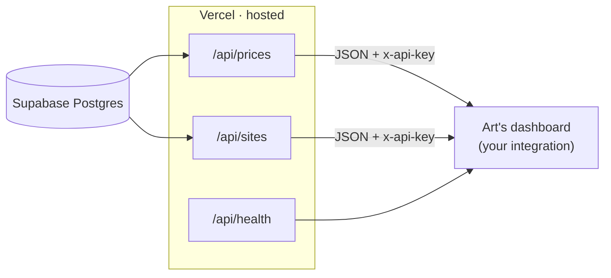

# Dashboard Integration Guide

**Audience:** Silas (technical) — wiring the iPhone-screen price data into Art's dashboard.

Everything is hosted. You point the dashboard at one URL with one key and read JSON —
no scraping, no database, nothing to run. This doc is the whole contract.

- **API base:** `https://phone-price-tracker-sigma.vercel.app`
- **Auth header:** `x-api-key: art_RfIaropliZDoi_Lr0FwfsbZZ7Ls4WYsH`
- **Format:** JSON · CORS enabled · 5-minute edge cache
- **In the DB now:** 4,440 prices · 3,628 shop · 864 buyback · 297 sites · 295 login-gated · 1,209 competitors catalogued

---

## 1 · 60-second test

```bash
API=https://phone-price-tracker-sigma.vercel.app
KEY=art_RfIaropliZDoi_Lr0FwfsbZZ7Ls4WYsH

curl -s $API/api/health                                             # open, for monitoring
curl -s -H "x-api-key: $KEY" "$API/api/prices?type=buyback"         # all buyback prices
curl -s -H "x-api-key: $KEY" "$API/api/prices?list=A"               # genuine-panel screens
curl -s -H "x-api-key: $KEY" "$API/api/sites?login=true"            # login-gated competitors
```

If those return JSON, you're ready. There is nothing to install to consume the API.

---

## 2 · Architecture (what you own)



You own only the dashboard box. Collection, database, and API are hosted and maintained
(the `screenscout` CLI keeps the data fresh — see [SCREENSCOUT.md](SCREENSCOUT.md)).

---

## 3 · Authentication

Send the header on every `/api/prices` and `/api/sites` call:

```
x-api-key: art_RfIaropliZDoi_Lr0FwfsbZZ7Ls4WYsH
```

Missing/wrong key → `401 {"error":"unauthorized"}`. `/api/health` needs no key.
CORS is `*`, but **call from your backend** so the key never ships in client JS.

---

## 4 · Endpoints

### `GET /api/prices`
Latest price for each distinct product `(site, sku, url)`.

| Param | Values | Meaning |
|---|---|---|
| `type` | `shop` · `buyback` | sells screens vs. buys broken screens |
| `list` | `A` · `B` · `buyback` · `aftermarket` | curated buckets (§5) |
| `category` | `original`, `pulled`, `refurb`, `glass-changed`, `flex-replaced`, `fog`, `aftermarket-incell`, `aftermarket-oled`, `aftermarket-soft-oled`, `aftermarket-hard-oled`, `aftermarket-lcd`, `aftermarket-tft`, `aftermarket-gx`, `buyback`, `unknown` | exact repair/quality type |
| `country` | e.g. `Germany`, `France` | filter by country |
| `sku` | e.g. `iphone-15-pro-max` | filter by model slug |
| `login` | `true` · `false` | only login-gated (or public) shops |

Params combine with AND — e.g. `?type=shop&country=Germany&list=A`.

**Response**
```json
{
  "count": 446,
  "updatedAt": "2026-08-06T15:00:00.000Z",
  "prices": [
    {
      "id": 84213,
      "site_id": "appleparts.nl",
      "type": "shop",
      "sku": "iphone-14-pro",
      "label": "iPhone 14 Pro scherm origineel pulled",
      "price": 199.0,
      "currency": "EUR",
      "country": "Netherlands",
      "category": "pulled",
      "list": "A",
      "grade": "original",
      "login": false,
      "url": "https://appleparts.nl/products/...",
      "scraped_at": "2026-08-05T22:10:00Z"
    }
  ]
}
```

### `GET /api/sites`
The competitor list — **including login-gated shops that have no public prices** (so you
see who exists even when we can't read their numbers).

| Param | Values |
|---|---|
| `login` | `true` · `false` |
| `type` | `shop` · `buyback` |

```json
{ "count": 295,
  "sites": [ { "site": "mpsmobile.de", "country": "Germany", "type": "shop", "login": true, "productsScraped": 0 } ] }
```

### `GET /api/health`
`{ "ok": true, "service": "phone-price-tracker", "time": "…" }` — open, for uptime checks.

---

## 5 · Data dictionary

### Shop `list` buckets
- **`A` — genuine Apple panels** (glass-changed / pulled / refurb / original). The premium list.
- **`B` — flex-replaced / fog** (a small genuine niche).
- **`aftermarket` — copy panels** (soft/hard OLED, in-cell, TFT).

### Buyback lists (which sites buy what — files in `deliverables/`)
- **List 1** — public price list, buys up to **iPhone 17** (the current, active ones). 22 sites.
- **List 2** — real buyback site, **no public price list** → contact required. 87 sites.
- **List 3** — public price list, but newest model bought is **older than 17**. 30 sites.

### Row fields
| Field | Notes |
|---|---|
| `site_id` | bare domain — the competitor identity |
| `sku` | model slug (`iphone-15-pro-max`); buyback adds `-grade-a…d` |
| `price` / `currency` | as listed on the site, in its own currency |
| `category` | fine-grained type (14 values above) |
| `list` | `A` / `B` / `buyback` / `aftermarket` |
| `grade` | `original` · `aftermarket` · `grade-A…D` |
| `login` | `true` = price sits behind a business account (§6) |
| `country` | 31 EU countries + global |

> **Currency / VAT:** prices are as-listed, per-site currency. A per-site VAT basis
> (incl/excl/unknown) lives in `deliverables/vat_basis.csv` if you want ex-VAT normalisation.

---

## 6 · Login-gated shops

**295 competitors hide prices behind a business login.** `/api/sites?login=true` lists
them (with `productsScraped: 0` where prices aren't visible yet). To unlock one, the
operator logs into it once (session saved, no password stored) and its prices then flow
into `/api/prices` like any other — see [SCREENSCOUT.md](SCREENSCOUT.md).

---

## 7 · Dashboard integration

Server-side fetch (keeps the key off the client):

```js
const API = "https://phone-price-tracker-sigma.vercel.app";
const KEY = process.env.SCREEN_API_KEY;              // set in your backend env

async function getPrices(params = {}) {
  const qs = new URLSearchParams(params).toString();
  const res = await fetch(`${API}/api/prices?${qs}`, {
    headers: { "x-api-key": KEY },
    next: { revalidate: 300 },                        // match the 5-min edge cache
  });
  if (!res.ok) throw new Error(`API ${res.status}`);
  return res.json();
}

const buyback  = await getPrices({ type: "buyback" });
const listA_de = await getPrices({ list: "A", country: "Germany" });
const gated    = await fetch(`${API}/api/sites?login=true`, { headers: { "x-api-key": KEY } }).then(r => r.json());
```

"Cheapest genuine panel per model" widget:

```js
const { prices } = await getPrices({ list: "A" });
const cheapest = {};
for (const p of prices) if (!cheapest[p.sku] || p.price < cheapest[p.sku].price) cheapest[p.sku] = p;
// cheapest[sku] -> { site_id, price, currency, category, url }
```

---

## 8 · Keys & links

| | |
|---|---|
| API base | `https://phone-price-tracker-sigma.vercel.app` |
| API key (`x-api-key`) | `art_RfIaropliZDoi_Lr0FwfsbZZ7Ls4WYsH` |
| Repo | `https://github.com/Momin010/phone-price-tracker` |
| Endpoints | `/api/prices` · `/api/sites` · `/api/health` |
| CLI / automation | [SCREENSCOUT.md](SCREENSCOUT.md) |

Everything above is live now — you can start wiring the dashboard immediately. Questions → Momin.
