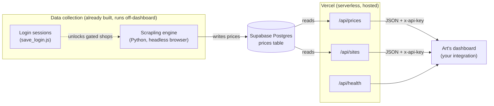
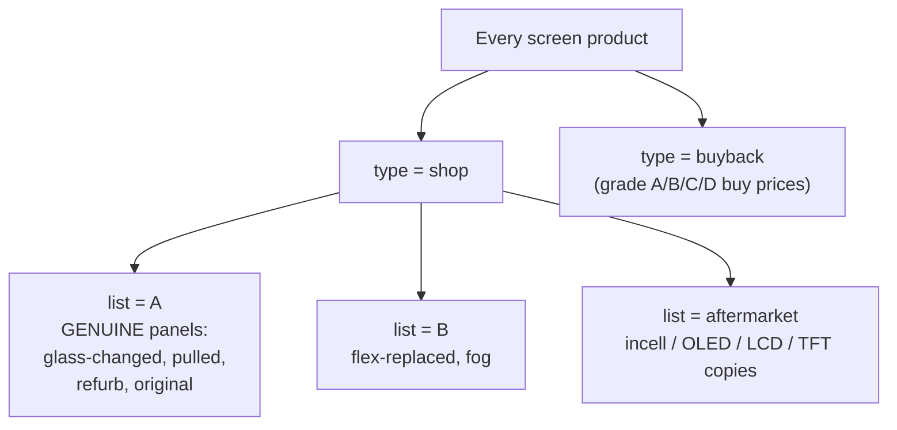
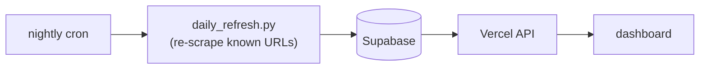

# iPhone Screen Price Intelligence — Integration Guide for Silas

**A single hosted API that returns live iPhone-screen pricing from ~1,190 European competitors (plus global), for both selling shops and buyback sites.** Everything is on the web — you don't host or scrape anything. You point Art's dashboard at one URL with one key and read JSON.

- **API base:** `https://phone-price-tracker-sigma.vercel.app`
- **Auth:** header `x-api-key: <key>` (key at the bottom of this doc)
- **Format:** JSON, CORS-enabled, 5-min edge cache
- **Data today:** 8,887 prices · 7,745 shop · 1,142 buyback · 1,190 EU competitors across 31 countries · 295 login-gated shops flagged

---

## 1. The 60-second test

Run these in any terminal. If they return JSON, you're done — the rest is just filters.

```bash
API=https://phone-price-tracker-sigma.vercel.app
KEY=art_RfIaropliZDoi_Lr0FwfsbZZ7Ls4WYsH

# health (no auth)
curl -s $API/api/health

# all buyback grade prices
curl -s -H "x-api-key: $KEY" "$API/api/prices?type=buyback"

# genuine-panel "List A" screens (glass-changed / pulled / refurb / original)
curl -s -H "x-api-key: $KEY" "$API/api/prices?list=A"

# every competitor shop, with a login-gated flag
curl -s -H "x-api-key: $KEY" "$API/api/sites"
```

There is **nothing to install** to consume the data. (Installation only matters if you want to run the daily refresh yourself — see §7.)

---

## 2. Architecture



**What you own:** only the box on the right — the dashboard calling the API. Collection, database, and API are hosted and maintained.

---

## 3. Authentication

Every `/api/prices` and `/api/sites` call needs the header:

```
x-api-key: art_RfIaropliZDoi_Lr0FwfsbZZ7Ls4WYsH
```

Missing/wrong key → `401 {"error":"unauthorized"}`. `/api/health` is open (use it for uptime checks). CORS is `*`, so you can call it from a browser dashboard directly, but **prefer calling from your backend** so the key isn't exposed in client JS.

---

## 4. Endpoints

### `GET /api/prices`
Returns the latest price for each distinct product `(site, sku, url)`.

| Query param | Values | Meaning |
|---|---|---|
| `type` | `shop` \| `buyback` | Shops that SELL screens vs sites that BUY broken screens |
| `list` | `A` \| `B` \| `buyback` \| `aftermarket` | Curated buckets (see §5) |
| `category` | `original`, `pulled`, `refurb`, `glass-changed`, `flex-replaced`, `fog`, `aftermarket-incell`, `aftermarket-oled`, `aftermarket-soft-oled`, `aftermarket-hard-oled`, `aftermarket-lcd`, `aftermarket-tft`, `aftermarket-gx`, `unknown`, `buyback` | Exact repair/quality type |
| `country` | e.g. `Germany`, `France`, `Poland` | Filter by country |
| `sku` | e.g. `iphone-14-pro` | Filter by model slug |
| `login` | `true` \| `false` | Only rows from login-gated (or public) shops |

Params combine (AND). Example: `?type=shop&country=Germany&list=A`.

**Response shape:**
```json
{
  "count": 551,
  "updatedAt": "2026-08-06T14:55:00.000Z",
  "prices": [
    {
      "id": 84213,
      "site_id": "appleparts.nl",
      "type": "shop",
      "sku": "iphone-14-pro",
      "label": "iPhone 14 Pro scherm origineel pulled",
      "price": 199.0,
      "currency": "EUR",
      "country": "Netherlands",
      "category": "pulled",
      "list": "A",
      "grade": "original",
      "login": false,
      "url": "https://appleparts.nl/products/...",
      "raw_price": "{\"grade\":\"original\",\"model\":\"iPhone 14 Pro\",\"category\":\"pulled\",\"list\":\"A\",\"login\":false}",
      "scraped_at": "2026-08-05T22:10:00Z"
    }
  ]
}
```

### `GET /api/sites`
The full competitor list — **including login-gated shops that have no public price rows** (this is where you see who exists even when we can't read their prices).

| Query param | Values | Meaning |
|---|---|---|
| `login` | `true` \| `false` | Only login-gated (or public) competitors |
| `type` | `shop` \| `buyback` | Filter by kind |

```json
{
  "count": 654,
  "sites": [
    { "site": "mpsmobile.de", "country": "Germany", "type": "shop", "login": true, "productsScraped": 0 }
  ]
}
```

### `GET /api/health`
`{ "ok": true, "service": "phone-price-tracker", "time": "..." }` — open, for monitoring.

---

## 5. Data dictionary

### The two things Art asked for, as `list` buckets


- **`list=A`** — genuine Apple panels (glass-changed / pulled / refurb / original). This is the "whatever is cheaper" premium list.
- **`list=B`** — flex-replaced + fog screens (a small, genuine niche — ~26 exist publicly; the rest live behind B2B logins).
- **`list=buyback`** — what buyback sites pay, split by grade (`sku` carries `-grade-a/b/c/d`).
- **`list=aftermarket`** — copy panels (soft/hard OLED, in-cell, TFT).

### Field reference
| Field | Notes |
|---|---|
| `site_id` | Bare domain, the competitor identity |
| `sku` | Model slug, e.g. `iphone-15-pro-max`; buyback adds `-grade-b` |
| `price` / `currency` | As listed on the site, in the shop's currency |
| `category` | Fine-grained repair/quality type (14 values, see §4) |
| `list` | `A` / `B` / `buyback` / `aftermarket` — the coarse bucket |
| `grade` | `original` \| `aftermarket` \| `grade-A..D` (from `raw_price`) |
| `login` | `true` = price sits behind a business account (see §6) |
| `country` | 31 EU countries covered (52 incl. global) |
| `raw_price` | JSON blob; source of `category`/`list`/`login`/`grade` if you parse client-side |

> **VAT:** shop prices are as-listed. A per-site VAT basis (incl/excl/unknown) is in `deliverables/vat_basis.csv` in the repo if Art wants ex-VAT normalization later.

---

## 6. Login-gated shops (the one honest gap)

```mermaid
sequenceDiagram
    participant Op as Operator (Art)
    participant B as save_login.js (headed browser)
    participant Store as auth/&lt;host&gt;.json
    participant Sc as scrape_authed.py
    participant DB as Supabase

    Op->>B: npm run auth <shop-host>
    B->>Op: opens real browser, Art logs in ONCE
    B->>Store: saves session cookies (no password stored)
    Sc->>Store: loads cookies
    Sc->>DB: writes the now-visible B2B prices
```

**295 competitors hide prices behind a business login.** `/api/sites?login=true` lists them all (with `productsScraped: 0` where we can't see prices yet). To unlock a shop's real prices, Art logs into it once via `save_login.js`; the session is reused and those prices then flow into `/api/prices` like any other. No credentials are stored — only the session cookie file.

---

## 7. Optional: run the daily refresh yourself

The dataset refreshes by re-scraping known product URLs — **deterministic, no AI, free.** You only need this if you want to control the cron; otherwise consume the API as-is.

```bash
git clone https://github.com/Momin010/phone-price-tracker.git
cd phone-price-tracker

# Python deps for the engine
python3 -m pip install "scrapling[fetchers]" extruct requests
scrapling install            # one-time browser fetch

# create engine/.env.local with the Supabase keys (ask Momin) then:
python3 engine/daily_refresh.py     # re-scrapes known URLs, updates the DB
```

Schedule it with cron/launchd (or the repo's `/setup` Claude Code command) to run nightly. The Vercel API always serves whatever is in the DB.



---

## 8. Dashboard integration example

Server-side fetch (recommended — keeps the key off the client):

```js
// Node / Next.js API route
const API = "https://phone-price-tracker-sigma.vercel.app";
const KEY = process.env.SCREEN_API_KEY;      // store the key in your env

async function getPrices(params = {}) {
  const qs = new URLSearchParams(params).toString();
  const res = await fetch(`${API}/api/prices?${qs}`, {
    headers: { "x-api-key": KEY },
    next: { revalidate: 300 },                // match the 5-min edge cache
  });
  if (!res.ok) throw new Error(`API ${res.status}`);
  return res.json();
}

// examples
const buyback   = await getPrices({ type: "buyback" });
const listA_de  = await getPrices({ list: "A", country: "Germany" });
const gated     = await fetch(`${API}/api/sites?login=true`, { headers: { "x-api-key": KEY } }).then(r => r.json());
```

A "cheapest genuine panel per model" widget:

```js
const { prices } = await getPrices({ list: "A" });
const cheapest = {};
for (const p of prices) {
  const k = p.sku;
  if (!cheapest[k] || p.price < cheapest[k].price) cheapest[k] = p;
}
// cheapest[sku] -> { site_id, price, currency, category, url }
```

---

## 9. Coverage snapshot (what's in the DB now)

| | |
|---|---|
| Total prices | **8,887** |
| Shop prices | 7,745 |
| Buyback prices | 1,142 |
| Distinct competitors (all) | ~370 with prices + 295 gated catalogued |
| **EU competitors mapped** | **1,190 across 31 countries** |
| Login-gated flagged | 295 |
| `list=A` (genuine panels) | ~905 rows (551 cheapest-per-model) |

Full per-country breakdown and the raw competitor list are in the repo: `deliverables/eu_competitors.csv` and `deliverables/eu_coverage_summary.csv`.

---

## 10. Data-integrity notes (so you can trust it)

- **No fabricated rows.** Every competitor was verified reachable; dead/unverifiable domains were dropped, not padded.
- **Deduped** on `(site, sku, url, price)`; null/zero/absurd prices removed.
- **Prices are as-listed** on each site in its own currency — do any FX/VAT normalization in the dashboard layer.
- **Freshness:** `scraped_at` per row; the daily refresh keeps public prices current. Login-gated prices are only as fresh as the last authed pull.

---

## 11. Keys & links

| | |
|---|---|
| API base | `https://phone-price-tracker-sigma.vercel.app` |
| API key (`x-api-key`) | `art_RfIaropliZDoi_Lr0FwfsbZZ7Ls4WYsH` |
| Repo | `https://github.com/Momin010/phone-price-tracker` |
| Endpoints | `/api/prices` · `/api/sites` · `/api/health` |

Questions on anything here → ping Momin. Everything above is live right now; you can start wiring the dashboard immediately.
